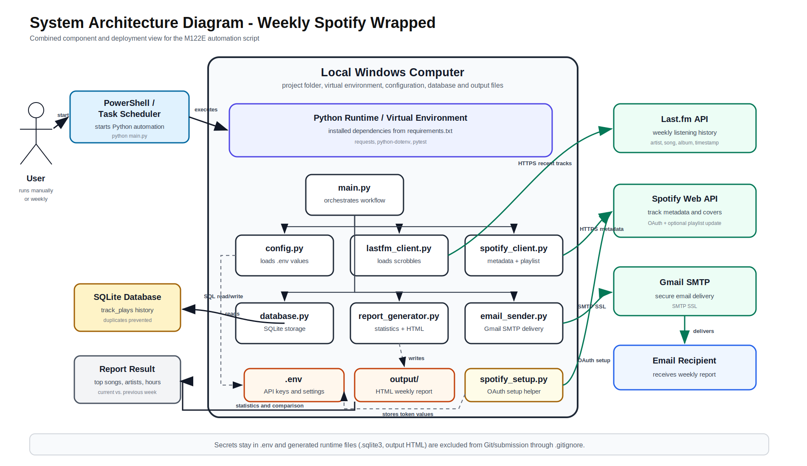
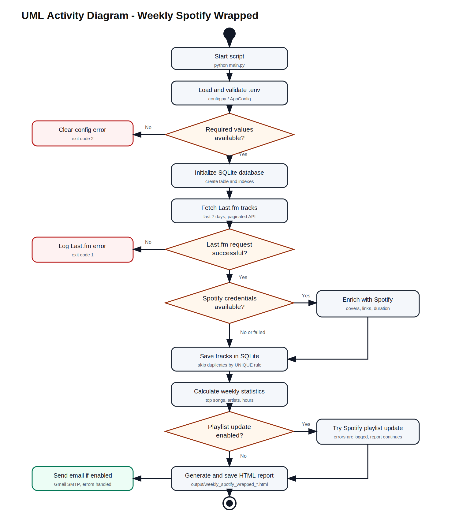
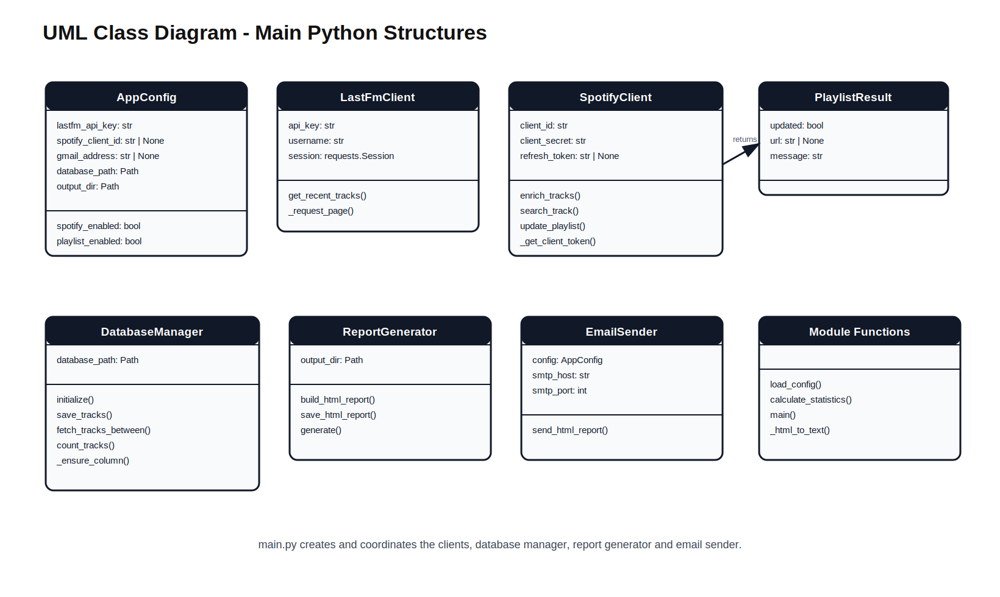
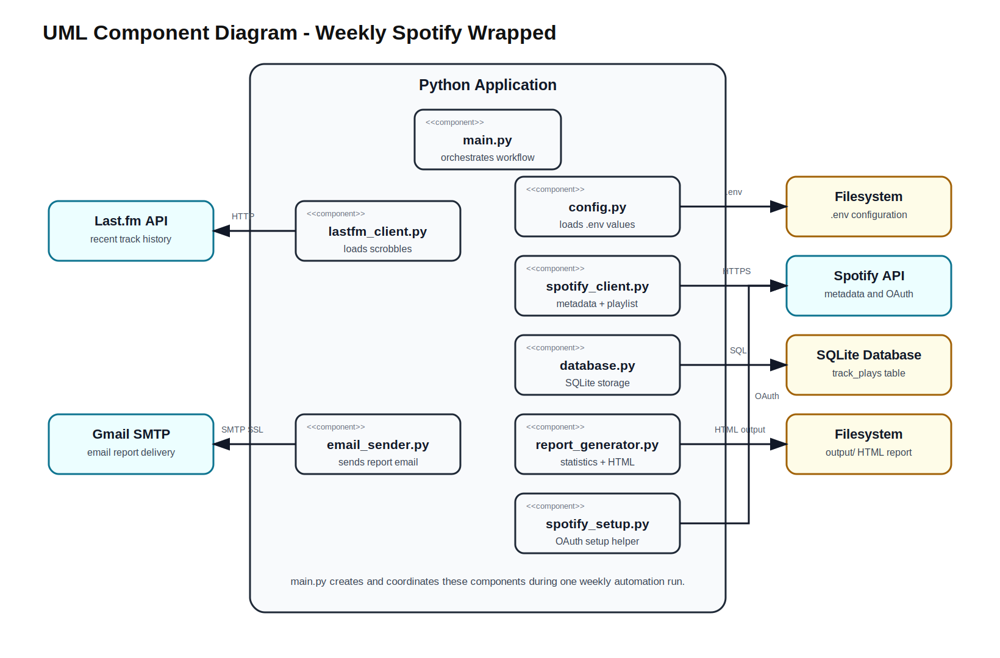
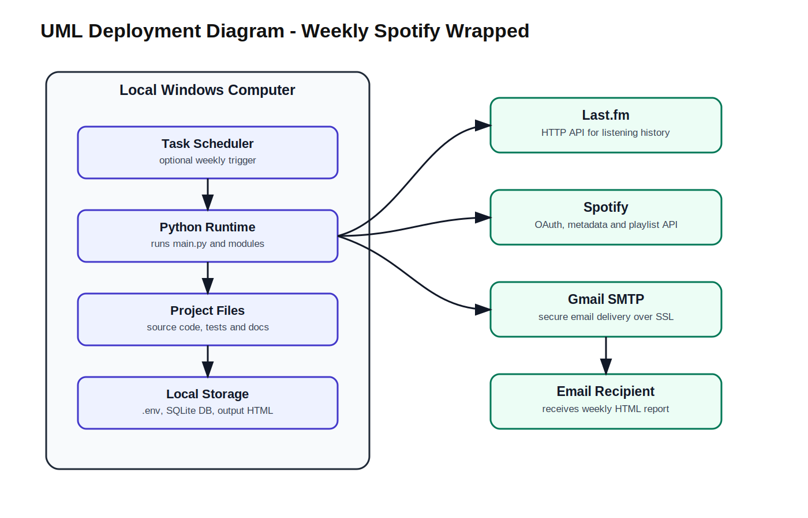
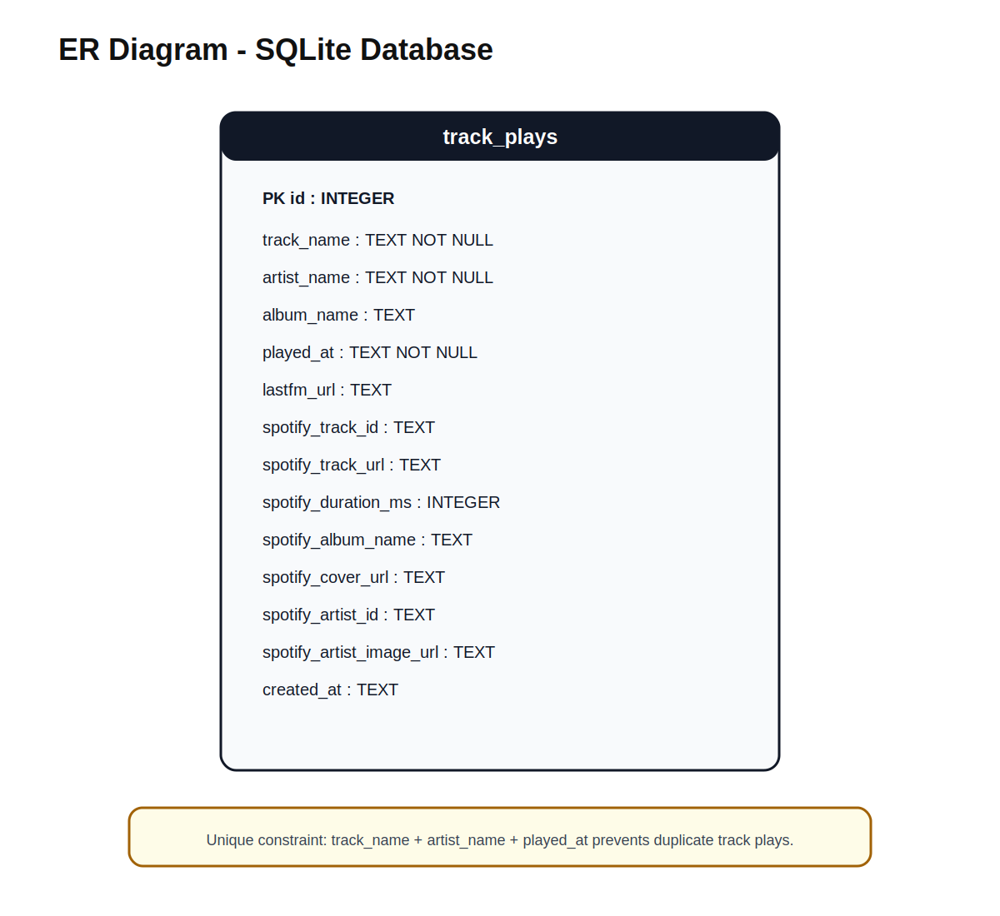
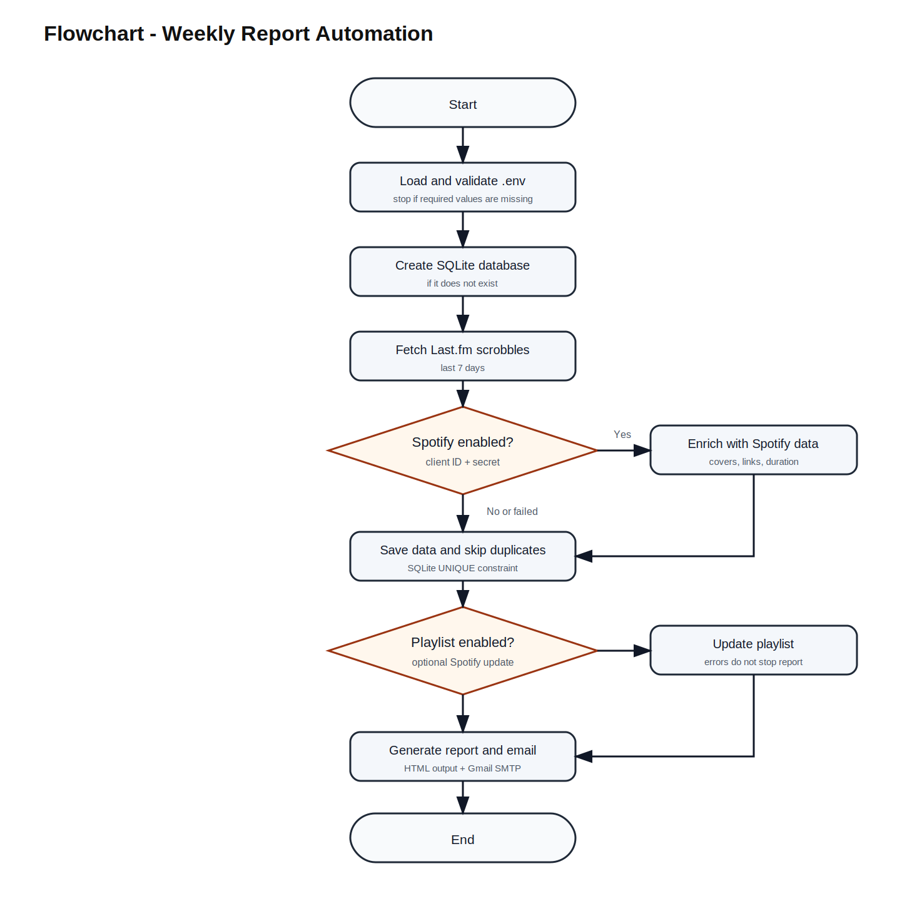

# Weekly Spotify Wrapped - M122E Final Documentation

## 1. Introduction and Context

Weekly Spotify Wrapped is a Python automation project for module M122E. The script automates the weekly analysis of personal music listening data and creates a personal recap instead of manually checking Last.fm, Spotify and email every week.

Last.fm is used as the main listening-history source because it provides the user's recent scrobbles for a selected period. Spotify enriches this data with track durations, Spotify links, album covers and artist images. SQLite stores the listening history locally so that the current week can be compared with the previous week. The final report is generated as a dark Spotify-style HTML file and can be sent automatically by Gmail SMTP.

The automated workflow includes:

- loading and validating `.env` configuration,
- fetching weekly Last.fm listening data,
- enriching tracks with Spotify metadata,
- storing track plays in SQLite and preventing duplicates,
- calculating weekly statistics,
- comparing the current week with the previous week,
- generating an HTML report,
- sending the report by email,
- optionally updating a Spotify playlist.

## 2. How I Worked

I worked through the project in the waterfall phases required by the assignment. First I clarified the automation scope and improved the proposal requirements so they were measurable and prioritized. After that I planned the modules, database table and external systems before implementing the script.

During implementation I tested the important parts step by step: configuration loading, Last.fm data loading, Spotify enrichment, SQLite duplicate handling, report generation and email sending. When Spotify playlist updates returned HTTP 403 because of permissions, I kept the feature optional and made sure the main report still completed. This made the project more reliable and easier to explain.

After the core workflow worked, I improved the email report design, added week-over-week comparison using the stored database history and created the diagrams and test protocol for the final submission.

## 3. Project Plan

The project followed the waterfall model:

| Phase | Planned Work | Result |
| --- | --- | --- |
| Requirements Analysis | Define project goal, involved systems and prioritized requirements. | Functional and non-functional requirements were documented with MoSCoW priorities. |
| Design | Design workflow, modules, database and external APIs. | UML, flowchart and ER diagrams were created in `docs/diagrams/`. |
| Development | Implement configuration, API clients, database, report generation and email sending. | A working modular Python automation script was implemented. |
| Testing | Create and execute unit tests and live workflow tests. | 35 pytest tests pass and live email delivery was verified. |
| Documentation | Prepare final documentation, README, proposal update and test protocol. | Final documentation package is stored in `docs/`. |
| Deployment | Plan weekly execution. | Windows Task Scheduler instructions are documented in the README. |

Project plan file: `M122E_Project_Plan_Spotify_Wrapped.xlsx`

## 4. Functional Requirements

| ID | Priority | Requirement | Implementation | Status |
| --- | --- | --- | --- | --- |
| FR-01 | Must | Load configuration values from `.env`. | `config.py` | Fulfilled |
| FR-02 | Must | Validate required values and show clear errors if values are missing. | `config.py`, `main.py` | Fulfilled |
| FR-03 | Must | Fetch Last.fm tracks from the last 7 days. | `lastfm_client.py` | Fulfilled |
| FR-04 | Must | Store listening data in a local SQLite database. | `database.py` | Fulfilled |
| FR-05 | Must | Prevent duplicate track plays. | SQLite `UNIQUE(track_name, artist_name, played_at)` | Fulfilled |
| FR-06 | Must | Calculate top songs, top artists, total tracks and listening time. | `report_generator.py` | Fulfilled |
| FR-07 | Must | Generate an HTML report and save it in `output/`. | `report_generator.py` | Fulfilled |
| FR-08 | Must | Send the weekly report by Gmail SMTP. | `email_sender.py` | Fulfilled |
| FR-09 | Should | Enrich tracks with Spotify metadata. | `spotify_client.py` | Fulfilled |
| FR-10 | Should | Continue running if Spotify enrichment fails. | `main.py`, `spotify_client.py` | Fulfilled |
| FR-11 | Should | Log important workflow steps and errors. | `main.py`, client modules | Fulfilled |
| FR-12 | Should | Compare the current week with the previous week. | SQLite history, `report_generator.py` | Fulfilled |
| FR-13 | Could | Create or update a Spotify playlist. | `spotify_setup.py`, `spotify_client.py` | Fulfilled as optional feature |
| FR-14 | Won't | Provide a graphical desktop or web UI. | Out of scope | Fulfilled |

## 5. Non-Functional Requirements

| ID | Category | Requirement | Implementation | Status |
| --- | --- | --- | --- | --- |
| NFR-01 | Security | Secrets must not be hardcoded in Python files. | `.env`, `.env.example`, `.gitignore` | Fulfilled |
| NFR-02 | Reliability | API, email and config errors must be handled clearly. | custom exceptions and logging | Fulfilled |
| NFR-03 | Maintainability | Code must be modular and easy to explain. | separate modules per responsibility | Fulfilled |
| NFR-04 | Testability | Core logic must be testable with pytest. | `tests/` | Fulfilled |
| NFR-05 | Usability | The project must be easy to install and run. | `README.md`, short instructions in this document | Fulfilled |
| NFR-06 | Performance | A normal weekly run should finish in reasonable time for personal data volume. | paginated API calls, local SQLite storage | Fulfilled |
| NFR-07 | Portability | The script should run on a normal Windows Python setup. | Python plus `requirements.txt` | Fulfilled |

## 6. System and Script Design

### Module Overview

| Module | Responsibility |
| --- | --- |
| `main.py` | Orchestrates the complete automation workflow. |
| `config.py` | Loads and validates environment variables. |
| `lastfm_client.py` | Fetches recent tracks from Last.fm. |
| `spotify_client.py` | Enriches tracks and optionally updates a playlist. |
| `database.py` | Creates and manages SQLite storage. |
| `report_generator.py` | Calculates statistics, comparisons and HTML report content. |
| `email_sender.py` | Sends the report through Gmail SMTP. |
| `spotify_setup.py` | One-time helper to create Spotify refresh token and playlist values. |

### Workflow

1. `main.py` loads the configuration.
2. The database is initialized.
3. Last.fm tracks are fetched.
4. Spotify enrichment runs if Spotify credentials are available.
5. Tracks are saved to SQLite and duplicates are skipped.
6. Current and previous period data are loaded from SQLite.
7. Statistics and comparisons are calculated.
8. The HTML report is generated and saved.
9. The email is sent if enabled.
10. Playlist update is attempted only if enabled.

### Diagrams

Diagram files are stored in `docs/diagrams/`:

- UML Activity Diagram: `uml_activity_diagram.svg`
- System Architecture Diagram: `system_architecture_diagram.svg`
- UML Class Diagram: `uml_class_diagram.svg`
- UML Component Diagram: `uml_component_diagram.svg`
- UML Deployment Diagram: `uml_deployment_diagram.svg`
- ER Diagram: `er_diagram.svg`
- Flowchart: `flowchart.svg`















## 7. Database Design

The database uses one main table: `track_plays`.

| Column | Type | Description |
| --- | --- | --- |
| `id` | INTEGER | Primary key |
| `track_name` | TEXT | Track title from Last.fm |
| `artist_name` | TEXT | Artist name |
| `album_name` | TEXT | Album from Last.fm if available |
| `played_at` | TEXT | UTC timestamp of the play |
| `lastfm_url` | TEXT | Last.fm track URL |
| `spotify_track_id` | TEXT | Spotify track ID |
| `spotify_track_url` | TEXT | Spotify track link |
| `spotify_duration_ms` | INTEGER | Track duration in milliseconds |
| `spotify_album_name` | TEXT | Spotify album name |
| `spotify_cover_url` | TEXT | Album cover URL |
| `spotify_artist_id` | TEXT | Spotify artist ID |
| `spotify_artist_image_url` | TEXT | Spotify artist image URL |
| `created_at` | TEXT | Insert timestamp |

Duplicate prevention:

```sql
UNIQUE(track_name, artist_name, played_at)
```

The database is important because it keeps historical listening data. Without it, the program could create a weekly report but could not reliably compare the current week with the previous week.

## 8. Installation and Usage

This section explains how the project is installed and started on Windows. The same information is also summarized in `README.md`.

### 8.1 Prerequisites

- Windows with PowerShell
- Python installed
- Last.fm account with API key
- Spotify Developer app for optional enrichment and playlist features
- Gmail account with app password if email sending is enabled

### 8.2 Install Dependencies

```powershell
cd C:\Users\voutats1\Documents\Gibz\Informatik\M122\M122ESpotifyProject\spotify_weekly_wrapped
python -m venv .venv
.\.venv\Scripts\Activate.ps1
python -m pip install -r requirements.txt
Copy-Item .env.example .env
```

### 8.3 Configure `.env`

The script must be configured through `.env`. No API keys or passwords are written directly into the Python files.

| Value | Purpose |
| --- | --- |
| `LASTFM_API_KEY` | Required for reading Last.fm scrobbles. |
| `LASTFM_USERNAME` | Last.fm user whose recent tracks are loaded. |
| `SPOTIFY_CLIENT_ID` | Spotify app client ID for metadata enrichment. |
| `SPOTIFY_CLIENT_SECRET` | Spotify app client secret for metadata enrichment. |
| `SPOTIFY_REFRESH_TOKEN` | Needed only for playlist updates. It can be created with `spotify_setup.py`. |
| `SPOTIFY_PLAYLIST_ID` | Existing or generated playlist ID. |
| `PLAYLIST_URL` | Link to the generated playlist. |
| `ENABLE_PLAYLIST` | `true` updates the playlist, `false` disables playlist updates. |
| `GMAIL_ADDRESS` | Sender email address. |
| `GMAIL_APP_PASSWORD` | Gmail app password, not the normal Gmail password. |
| `RECIPIENT_EMAIL` | Receiver email address. |
| `SEND_EMAIL` | `true` sends the report, `false` only creates the HTML report. |
| `LOOKBACK_DAYS` | Default is `7`. |
| `DATABASE_PATH` | Default is `spotify_wrapped.sqlite3`. |
| `OUTPUT_DIR` | Default is `output`. |

### 8.4 API Setup

Last.fm:

1. Create an API application at `https://www.last.fm/api/account/create`.
2. Copy the API key into `LASTFM_API_KEY`.
3. Add the Last.fm username to `LASTFM_USERNAME`.

Spotify:

1. Create an app at `https://developer.spotify.com/dashboard`.
2. Add `http://127.0.0.1:8888/callback` as redirect URI.
3. Copy client ID and client secret into `.env`.
4. Run `python spotify_setup.py` if playlist updates should be used.

Gmail:

1. Enable 2-Step Verification in the Google account.
2. Create a Google app password.
3. Add the generated app password to `GMAIL_APP_PASSWORD`.

### 8.5 Start the Program

```powershell
.\.venv\Scripts\Activate.ps1
python main.py
```

Expected result:

- SQLite database is created or updated.
- Last.fm tracks are loaded.
- Spotify metadata is added if Spotify is configured.
- HTML report is saved in `output/`.
- Email is sent if `SEND_EMAIL=true`.
- Playlist is updated only if `ENABLE_PLAYLIST=true` and permissions are valid.

### 8.6 Run Tests

```powershell
python -m pytest
```

### 8.7 Weekly Automation

The script can be automated with Windows Task Scheduler.

Program:

```text
C:\Users\voutats1\Documents\Gibz\Informatik\M122\M122ESpotifyProject\spotify_weekly_wrapped\.venv\Scripts\python.exe
```

Arguments:

```text
main.py
```

Start in:

```text
C:\Users\voutats1\Documents\Gibz\Informatik\M122\M122ESpotifyProject\spotify_weekly_wrapped
```

## 9. Test Protocol Summary

Unit tests are stored in `tests/` and executed with:

```powershell
python -m pytest
```

Latest verified result:

```text
35 passed
```

Live workflow result:

- Last.fm data was loaded.
- Spotify enrichment completed.
- SQLite stored data and skipped duplicates on repeated runs.
- Week-over-week comparison was generated from stored SQLite history.
- HTML report was generated.
- Email was successfully delivered.
- Optional Spotify playlist update returned HTTP 403 and was handled without stopping the report/email workflow.

Full protocol: `M122E_Test_Protocol.md`

## 10. Assignment Coverage

| Assignment Requirement | Evidence |
| --- | --- |
| Script performs multiple actions | Fetch data, enrich data, store database rows, calculate statistics, generate report, send email. |
| Script is well-organized | Separate modules with clear responsibilities. |
| Environment variables are used | `.env`, `.env.example`, `config.py`. |
| `requirements.txt` exists | `requests`, `python-dotenv`, `pytest`. |
| Clear start command exists | `python main.py`, documented in README and this document. |
| Documentation includes context | Sections 1 and 2. |
| Documentation includes project plan | Section 3 and Excel project plan. |
| Requirements are prioritized | Sections 4 and 5. |
| Script design is documented | Section 6 plus diagrams. |
| Instructions are included | Section 8 and README. |
| Test protocol is executed | Section 9 and `M122E_Test_Protocol.md`. |

## 11. Conclusion

The project fulfills the M122E automation assignment because it automates a realistic multi-step weekly task, uses multiple external systems, protects secrets through environment variables, stores historical data in SQLite, includes automated tests, handles expected errors and provides clear documentation. The implementation is also structured so that the workflow, database and modules can be explained with diagrams during the final submission.
